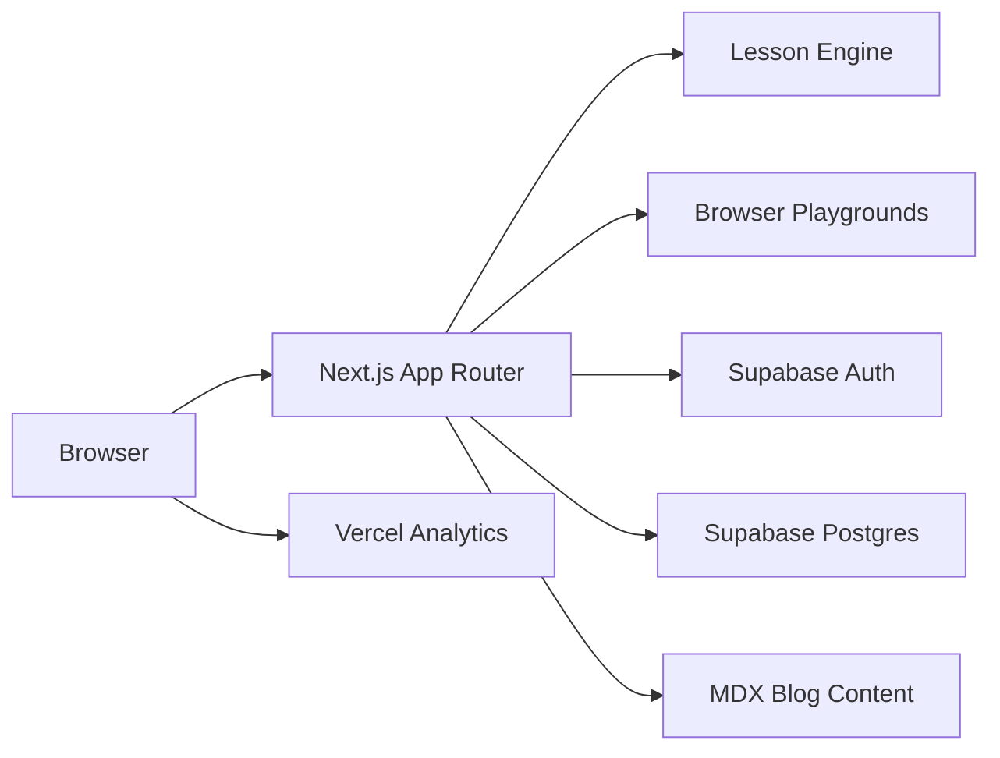

# The Grey Project

Interactive AI learning platform — free courses with browser sandboxes, Grey Points gamification, and completion certificates.

[](LICENSE)
[](https://nextjs.org)
[](https://react.dev)
[](https://www.typescriptlang.org)
[](https://supabase.com)

**Live site:** [thegreyproject.com](https://www.thegreyproject.com) · **Repo:** [github.com/vaibhavkestikar/the-grey-project](https://github.com/vaibhavkestikar/the-grey-project)

---

## About

The Grey Project is an open-source interactive AI learning platform built by [Vaibhav Kestikar](https://www.thegreyproject.com/about). It teaches how AI actually works through hands-on lessons with in-browser playgrounds — Python sandboxes, tokenizers, prompt labs, neuron visualizations, and more.

Learners progress through structured paths, earn **Grey Points** and skill badges, unlock store rewards, and receive PDF completion certificates. The **Curious Builders** path is live now; additional paths (First Build, Foundations of AI) are in development.

This repository is named `the-grey-factory` locally and `the-grey-project` on GitHub.

---

## Features

### Learning

- **Interactive lesson engine** — block-based lessons (`hook`, `visual`, `play`, `checkpoint`, `build`, `reflect`) defined in TypeScript
- **Curious Builders path** — live free lessons on prediction, prompting, hallucinations, ML workflows, and more
- **In-browser playgrounds** — Python sandbox, tokenizer, prompt lab, embedding explorer, neuron sandbox, hallucination lab, and others
- **Free sample lessons** — `/try` routes let visitors explore without signing up
- **Guest progress** — localStorage-based progress that merges on signup

### Gamification

- **Grey Points** — awarded for steps, checkpoints, deep dives, and lesson/path completion
- **Badges** — skill badges earned per lesson (e.g. Prediction Purist, Prompt Architect)
- **Grey Store** — redeem points for downloadable rewards
- **Streaks and XP** — tracked in learner profiles

### Certificates

- **Completion certificates** — PDF certificates issued via `POST /api/certificate/issue`
- **Certificate gallery** — list and download via `GET /api/certificate/list`

### Platform

- **Supabase authentication** — register, login, email verification, password reset
- **Mobile-friendly auth callbacks** — `token_hash` flow via [`proxy.ts`](proxy.ts)
- **MDX blog** — `/blog` with research and explainer posts
- **Site and path feedback** — NPS and ratings via feedback API routes
- **Waitlist** — sign up for upcoming learning paths
- **First-party analytics** — custom event logging and auth funnel tracking
- **SEO** — sitemap, robots.txt, Open Graph metadata
- **Vercel Analytics + Speed Insights**

---

## Tech Stack

| Layer | Technology |
|-------|------------|
| Framework | Next.js 16 (App Router) |
| UI | React 19, TypeScript 5 |
| Styling | Tailwind CSS 3, shadcn/ui, Framer Motion |
| Auth & Database | Supabase (`@supabase/ssr`) |
| Content | MDX via `next-mdx-remote`, structured JSON lessons |
| PDF | html2canvas + jsPDF (certificates) |
| Validation | Zod |
| Testing | Vitest |
| Deployment | Vercel |

---

## Architecture



Lesson content lives in [`content/lessons/`](content/lessons/) as structured TypeScript files. Each lesson is an ordered sequence of blocks rendered by the lesson engine in [`components/learning/lesson-engine.tsx`](components/learning/lesson-engine.tsx). See [`docs/V2_ARCHITECTURE.md`](docs/V2_ARCHITECTURE.md) for the full layout.

---

## Prerequisites

- Node.js 20+
- npm, pnpm, or yarn
- A [Supabase](https://supabase.com) project

---

## Quick Start

```bash
git clone https://github.com/vaibhavkestikar/the-grey-project.git
cd the-grey-project
npm install
cp .env.example .env.local
# Fill in your Supabase values in .env.local
npm run dev
```

Open [http://localhost:3000](http://localhost:3000).

---

## Environment Variables

Copy [`.env.example`](.env.example) to `.env.local` and fill in the values.

| Variable | Required | Description |
|----------|----------|-------------|
| `NEXT_PUBLIC_SUPABASE_URL` | Yes | Supabase project URL |
| `NEXT_PUBLIC_SUPABASE_ANON_KEY` | Yes | Supabase anon/public key |
| `SUPABASE_SERVICE_ROLE_KEY` | Yes (for API routes) | Service role key for server-side writes (certificates, grey points, feedback, waitlist). Without it, those routes fail gracefully |
| `NEXT_PUBLIC_SITE_URL` | Recommended | Canonical public URL for auth email links. Must match Supabase redirect allow list |

`VERCEL_URL` is set automatically on Vercel deployments and used as a fallback for site URL resolution.

---

## Supabase Setup

### 1. Create a Supabase project

Create a new project at [supabase.com](https://supabase.com) and note your project URL and API keys.

### 2. Run migrations

Run these SQL files in the Supabase SQL editor (in order):

| File | Purpose |
|------|---------|
| [`supabase/migrations/002_v2_schema.sql`](supabase/migrations/002_v2_schema.sql) | Auth funnel, analytics, learner profiles, lesson sessions |
| [`supabase/migrations/003_lesson_progress_certificate.sql`](supabase/migrations/003_lesson_progress_certificate.sql) | Lesson progress and certificate tracking |
| [`supabase/migrations/004_grey_points.sql`](supabase/migrations/004_grey_points.sql) | Grey Points, badges, store redemptions |
| [`supabase/migrations/005_lesson_progress_rls.sql`](supabase/migrations/005_lesson_progress_rls.sql) | Row-level security for lesson progress |
| [`supabase/feedback.sql`](supabase/feedback.sql) | Site feedback and path feedback tables |
| [`supabase/waitlist-unique-email.sql`](supabase/waitlist-unique-email.sql) | Waitlist table with unique email constraint |

### 3. Create the `user_profiles` table

There is no migration for this table in the repo. Create it manually:

```sql
CREATE TABLE public.user_profiles (
  id UUID PRIMARY KEY REFERENCES auth.users(id) ON DELETE CASCADE,
  full_name TEXT,
  email TEXT,
  current_job_role TEXT,
  learning_goal TEXT,
  country TEXT,
  years_of_experience TEXT,
  linkedin_url TEXT,
  created_at TIMESTAMPTZ DEFAULT NOW(),
  updated_at TIMESTAMPTZ DEFAULT NOW()
);

ALTER TABLE public.user_profiles ENABLE ROW LEVEL SECURITY;

CREATE POLICY "Users can view own profile"
  ON public.user_profiles FOR SELECT
  USING (auth.uid() = id);

CREATE POLICY "Users can insert own profile"
  ON public.user_profiles FOR INSERT
  WITH CHECK (auth.uid() = id);

CREATE POLICY "Users can update own profile"
  ON public.user_profiles FOR UPDATE
  USING (auth.uid() = id);
```

### 4. Configure authentication

Set redirect URLs, email templates, and Site URL. Full instructions are in [`docs/SUPABASE_AUTH_SETUP.md`](docs/SUPABASE_AUTH_SETUP.md).

Key points:

- Add `/auth/callback` and `/auth/callback/recovery` (with `type` query variants) for both localhost and your production domain
- Set Supabase **Site URL** to match `NEXT_PUBLIC_SITE_URL`
- Use `token_hash` links in email templates for mobile-friendly verification

---

## Project Structure

```
the-grey-project/
├── app/
│   ├── api/                # certificates, grey points, feedback, analytics, waitlist
│   ├── auth/callback/      # Supabase auth callbacks
│   ├── blog/               # Blog list + [slug] MDX pages
│   ├── learning/           # Learning paths and lesson pages
│   ├── try/                # Free sample lessons (no auth)
│   └── account/            # Profile, XP, certifications
├── components/
│   ├── learning/           # Lesson engine, course UI, certificates
│   ├── playgrounds/        # Interactive sandboxes
│   ├── marketing/          # Home, navbar, hero, CTAs
│   ├── growth/             # Waitlist, countdown, path cards
│   └── feedback/           # NPS/rating inputs
├── content/
│   ├── lessons/            # Structured JSON lesson definitions
│   └── blog/               # MDX blog posts
├── data/                   # Path configs, curriculum, blog metadata
├── docs/                   # Architecture and Supabase setup guides
├── lib/
│   ├── auth/               # Callback, funnel, redirect URLs
│   ├── grey/               # Points, badges, store, PDF generation
│   ├── learning/           # Progress, certificates, guest merge
│   └── supabase/           # Client, server, admin clients
├── supabase/migrations/    # SQL migrations
├── proxy.ts                # Auth callback redirect handler
└── next.config.mjs
```

---

## API Routes

| Route | Method | Purpose |
|-------|--------|---------|
| `/api/analytics` | POST | Custom event logging |
| `/api/auth/funnel` | POST | Auth funnel timestamps |
| `/api/certificate/issue` | POST | Issue completion certificate |
| `/api/certificate/list` | GET | List user certificates |
| `/api/feedback/site` | POST | Site-wide NPS and ratings |
| `/api/feedback/path` | POST | Path completion feedback |
| `/api/grey/award` | POST | Award Grey Points |
| `/api/grey/summary` | GET | User points, badges, streak |
| `/api/grey/store/redeem` | POST | Redeem store item |
| `/api/grey/store/[itemId]/download` | GET | Download redeemed item |
| `/api/waitlist` | POST | Join path waitlist |

---

## Scripts

| Script | Description |
|--------|-------------|
| `npm run dev` | Dev server (webpack) |
| `npm run dev:turbo` | Dev server (Turbopack) |
| `npm run build` | Production build |
| `npm run start` | Production server |
| `npm run lint` | ESLint |
| `npm run typecheck` | TypeScript check |
| `npm test` | Vitest |

---

## Deployment

[Vercel](https://vercel.com) is the recommended platform. Analytics and Speed Insights are already integrated.

1. Connect the GitHub repo to Vercel
2. Set all environment variables from `.env.example`
3. Set `NEXT_PUBLIC_SITE_URL` to your production domain (e.g. `https://www.thegreyproject.com`)
4. Ensure Supabase redirect URLs and Site URL match your production domain

---

## Contributing

1. Fork the repository
2. Create a feature branch (`git checkout -b feature/my-change`)
3. Make your changes
4. Run checks before submitting:
   ```bash
   npm run lint
   npm run typecheck
   npm test
   ```
5. Open a pull request with a clear description of the change

Keep PRs focused and match the existing code style.

---

## License

This project is licensed under the [MIT License](LICENSE).

---

## Author

**Vaibhav Kestikar** — Senior Data Scientist, AI educator

- Website: [thegreyproject.com](https://www.thegreyproject.com)
- GitHub: [@vaibhavkestikar](https://github.com/vaibhavkestikar)
