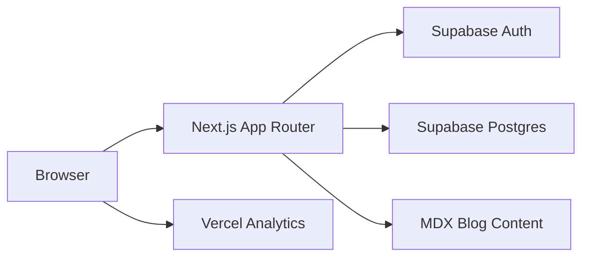

# The Grey Project

Paid, live AI workshops for engineering colleges — industry landscape plus a hands-on agentic project.

[](LICENSE)
[](https://nextjs.org)
[](https://react.dev)
[](https://www.typescriptlang.org)
[](https://supabase.com)

**Live site:** [thegreyproject.com](https://www.thegreyproject.com) · **Repo:** [github.com/vaibhavkestikar/the-grey-project](https://github.com/vaibhavkestikar/the-grey-project) · **Book a workshop:** [thegreyproject.com/for-colleges](https://www.thegreyproject.com/for-colleges)

---

## About

The Grey Project is a marketing and lead-generation site for **paid, in-person AI workshops** delivered at engineering colleges in India. The workshop runs as two sessions: an industry theory session and a hands-on agentic AI project build. Students leave with a portfolio piece and a certificate of completion.

This repository (`the-grey-factory` locally, `the-grey-project` on GitHub) powers the public website: workshop pages, college inquiry forms, user authentication, an MDX blog, and site feedback collection.

This is **not** a full learning management system. Earlier versions included self-paced courses, grey points gamification, and certificate APIs — those features have been removed from the app. Some legacy Supabase migrations remain in the repo but are not required for a fresh install.

Built by [Vaibhav Kestikar](https://www.thegreyproject.com/about).

---

## Features

- **Workshop marketing** — `/workshops`, `/workshops/theory`, `/workshops/agentic-project`
- **College inquiry form** — `/for-colleges` with leads stored via `POST /api/inquiry`
- **Supabase authentication** — register, login, email verification, password reset
- **Mobile-friendly auth callbacks** — `token_hash` flow via [`proxy.ts`](proxy.ts) (no PKCE cookie dependency)
- **MDX blog** — `/blog` and `/blog/[slug]` with GFM support
- **Site feedback** — NPS and ratings via `POST /api/feedback/site`
- **First-party analytics** — custom event logging via `POST /api/analytics`
- **Auth funnel tracking** — signup milestones via `POST /api/auth/funnel`
- **SEO** — sitemap, robots.txt, Open Graph metadata
- **Vercel Analytics + Speed Insights** — built into the root layout

---

## Tech Stack

| Layer | Technology |
|-------|------------|
| Framework | Next.js 16 (App Router) |
| UI | React 19, TypeScript 5 |
| Styling | Tailwind CSS 3, shadcn/ui, Framer Motion |
| Auth & Database | Supabase (`@supabase/ssr`) |
| Content | MDX via `next-mdx-remote`, `remark-gfm` |
| Validation | Zod |
| Testing | Vitest |
| Deployment | Vercel |

---

## Architecture



---

## Prerequisites

- Node.js 20+
- npm, pnpm, or yarn
- A [Supabase](https://supabase.com) project

---

## Quick Start

```bash
git clone https://github.com/vaibhavkestikar/the-grey-project.git
cd the-grey-project
npm install
cp .env.example .env.local
# Fill in your Supabase values in .env.local
npm run dev
```

Open [http://localhost:3000](http://localhost:3000).

---

## Environment Variables

Copy [`.env.example`](.env.example) to `.env.local` and fill in the values.

| Variable | Required | Description |
|----------|----------|-------------|
| `NEXT_PUBLIC_SUPABASE_URL` | Yes | Supabase project URL |
| `NEXT_PUBLIC_SUPABASE_ANON_KEY` | Yes | Supabase anon/public key |
| `SUPABASE_SERVICE_ROLE_KEY` | Yes (for API routes) | Service role key for server-side writes. Without it, inquiry/feedback return 500 and analytics/funnel silently skip DB writes |
| `NEXT_PUBLIC_SITE_URL` | Recommended | Canonical public URL for auth email links. Must match Supabase redirect allow list |

`VERCEL_URL` is set automatically on Vercel deployments and used as a fallback for site URL resolution.

---

## Supabase Setup

### 1. Create a Supabase project

Create a new project at [supabase.com](https://supabase.com) and note your project URL and API keys.

### 2. Run migrations

Run these SQL files in the Supabase SQL editor (in order):

| File | Purpose |
|------|---------|
| [`supabase/migrations/002_v2_schema.sql`](supabase/migrations/002_v2_schema.sql) | `user_auth_funnel`, `analytics_events` |
| [`supabase/migrations/007_workshop_inquiries.sql`](supabase/migrations/007_workshop_inquiries.sql) | College inquiry leads |
| [`supabase/feedback.sql`](supabase/feedback.sql) | `site_feedback` table (first section only) |

**Legacy migrations (skip for fresh installs):** `003`, `004`, and `005` cover lesson progress and grey points gamification from an earlier version of the app.

### 3. Create the `user_profiles` table

There is no migration for this table in the repo. Create it manually:

```sql
CREATE TABLE public.user_profiles (
  id UUID PRIMARY KEY REFERENCES auth.users(id) ON DELETE CASCADE,
  full_name TEXT,
  email TEXT,
  current_job_role TEXT,
  learning_goal TEXT,
  country TEXT,
  years_of_experience TEXT,
  linkedin_url TEXT,
  created_at TIMESTAMPTZ DEFAULT NOW(),
  updated_at TIMESTAMPTZ DEFAULT NOW()
);

ALTER TABLE public.user_profiles ENABLE ROW LEVEL SECURITY;

CREATE POLICY "Users can view own profile"
  ON public.user_profiles FOR SELECT
  USING (auth.uid() = id);

CREATE POLICY "Users can insert own profile"
  ON public.user_profiles FOR INSERT
  WITH CHECK (auth.uid() = id);

CREATE POLICY "Users can update own profile"
  ON public.user_profiles FOR UPDATE
  USING (auth.uid() = id);
```

### 4. Configure authentication

Set redirect URLs, email templates, and Site URL. Full instructions are in [`docs/SUPABASE_AUTH_SETUP.md`](docs/SUPABASE_AUTH_SETUP.md).

Key points:

- Add `/auth/callback` and `/auth/callback/recovery` (with `type` query variants) for both localhost and your production domain
- Set Supabase **Site URL** to match `NEXT_PUBLIC_SITE_URL`
- Use `token_hash` links in email templates for mobile-friendly verification

---

## Project Structure

```
the-grey-project/
├── app/                    # Next.js App Router pages, layouts, API routes
│   ├── api/                # inquiry, feedback, analytics, auth funnel
│   ├── auth/callback/      # Supabase auth callbacks
│   ├── blog/               # Blog list + [slug] MDX pages
│   ├── workshops/          # Workshop marketing pages
│   └── for-colleges/       # College inquiry page
├── components/
│   ├── auth/               # Login, register, verify, callback views
│   ├── marketing/          # Navbar, footer, hero, workshop pages
│   ├── feedback/           # NPS/rating inputs
│   └── ui/                 # shadcn primitives
├── content/blog/           # MDX blog source files
├── data/                   # workshops.ts, blog-posts.ts
├── docs/                   # Supabase auth setup guide
├── lib/
│   ├── auth/               # Callback, funnel, redirect URLs
│   ├── supabase/           # Client, server, admin clients
│   └── env.ts              # Zod-validated env parsing
├── public/                 # Static assets
├── supabase/
│   ├── migrations/         # SQL migrations
│   └── feedback.sql        # Feedback schema
├── proxy.ts                # Auth callback redirect handler
└── next.config.mjs         # Legacy URL redirects
```

---

## Scripts

| Script | Description |
|--------|-------------|
| `npm run dev` | Dev server (webpack) |
| `npm run dev:turbo` | Dev server (Turbopack) |
| `npm run build` | Production build |
| `npm run start` | Production server |
| `npm run lint` | ESLint |
| `npm run typecheck` | TypeScript check |
| `npm test` | Vitest |

---

## Deployment

[Vercel](https://vercel.com) is the recommended platform. Analytics and Speed Insights are already integrated.

1. Connect the GitHub repo to Vercel
2. Set all environment variables from `.env.example`
3. Set `NEXT_PUBLIC_SITE_URL` to your production domain (e.g. `https://www.thegreyproject.com`)
4. Ensure Supabase redirect URLs and Site URL match your production domain

Legacy URL redirects from the old learning platform are configured in [`next.config.mjs`](next.config.mjs) (`/learning/*`, `/try/*`, `/roadmap`).

---

## Contributing

1. Fork the repository
2. Create a feature branch (`git checkout -b feature/my-change`)
3. Make your changes
4. Run checks before submitting:
   ```bash
   npm run lint
   npm run typecheck
   npm test
   ```
5. Open a pull request with a clear description of the change

Keep PRs focused and match the existing code style.

---

## License

This project is licensed under the [MIT License](LICENSE).

---

## Author

**Vaibhav Kestikar** — Senior Data Scientist, workshop instructor

- Website: [thegreyproject.com](https://www.thegreyproject.com)
- GitHub: [@vaibhavkestikar](https://github.com/vaibhavkestikar)
